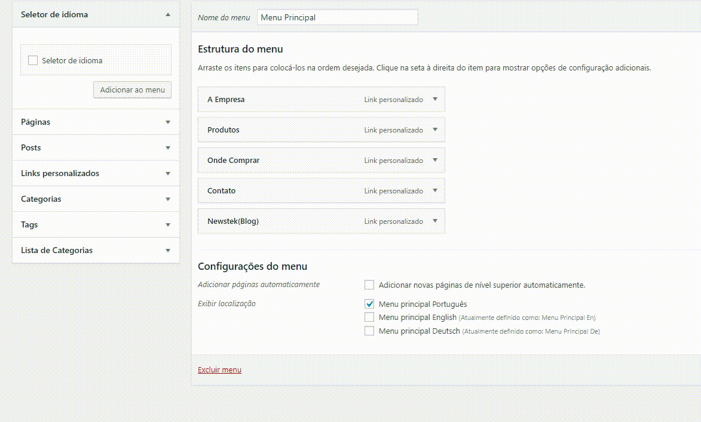

# droide-listcategory
This is a wordpress plugin, which enables category listing through the menu.



## installation instructions

After installing this plugin create a folder within the current theme:
```
themes/current-theme/droide_categories_pages/layout_list.php
 
```

## Releases

In this version 1.0, the plugin restricts the term of the url "categorias" to generate the customized layout.

## Upcoming Updates

* Add multiple layouts;
* The administrator determines the restricted urls;